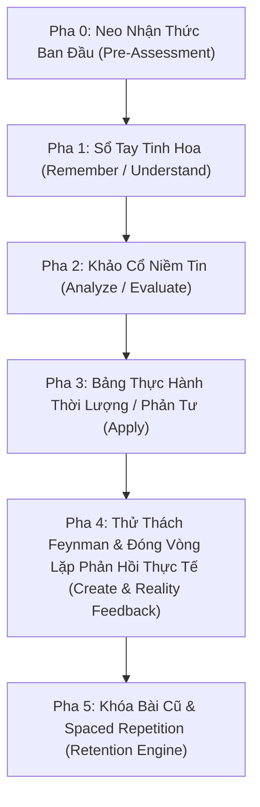

# Skill: Deep Learning OS (Hệ Điều Hành Học Sâu Khép Kín)

> Triết lý: "Học không phải là tích trữ thông tin. Học là một vòng lặp tự tiến hóa: Neo nhận thức ban đầu Phân tích tinh hoa Thử nghiệm thực tế Cập nhật niềm tin mới."
> Nguyên tắc vàng: HÀNH ĐỘNG TRƯỚC - NẠP MỚI SAU - KHÉP KÍN VÒNG LẶP PHẢN TƯ.

---

## KHI NÀO KÍCH HOẠT (TRIGGERS)

Skill được kích hoạt khi:
- User gõ `/skill @deep-learning` hoặc "học sâu bài này", "chuyển hóa kiến thức", "học theo thang bloom".
- User cung cấp link YouTube, File PDF/Ebook, Ghi chép khóa học Zoom, Bài viết web dài.

---

## CƠ CHẾ KHÓA KHẢO BÀI CỦ & NEO NHẬN THỨC BAN ĐẦU (PHASE 0 & GATING)

### 1. Khảo Bài Cũ 60s & Lặp Lại Ngắt Quãng (Spaced Repetition Checkpoint)
Trước khi nhận tài liệu mới:
- AI ngẫu nhiên chọn 1 Worldview/Tục ngữ cũ trong `_INDEX.md` và hỏi: "Nhắc nhớ ngẫu nhiên: Bạn còn nhớ bài học '[Tên Worldview]' hôm trước không?"
- User trả lời ngắn 1-2 câu theo ngôn ngữ cá nhân HOẶC xác nhận trạng thái thực hành.

### 2. Phần Chuẩn Bị: Neo Nhận Thức Ban Đầu (Anchoring & Pre-Assessment)
Trước khi lập Sổ Tay Tinh Hoa, AI đặt 1 câu hỏi định hình:
- "Trước khi tìm hiểu nội dung này, bạn đang có suy nghĩ/niềm tin ban đầu gì về chủ đề này?"
- Mục đích: Tạo điểm đối chiếu (Before vs After) để đo lường chính xác mức độ chuyển hóa nhận thức.

---

## BỘ 3 TÀI SẢN P.A.R.A CHUẨN HÓA

Mỗi bài học lưu tại `d: \Antigravity\love myself\Hoc-Sau\[Nguon-Du-Lieu]\YYYY-MM-DD_ten-chu-de\`:

```
YYYY-MM-DD_ten-chu-de/
├── 1. transcript_book.md TẦNG 1-2: NHỚ & HIỂU (Sổ tay tinh hoa long-form 300+ dòng)
├── 2. analysis.md TẦNG 3-4: PHÂN TÍCH & ĐÁNH GIÁ (Khảo cổ 3 Worldviews, Tension, Pre/Post Anchoring)
└── 3. execution_checklist.md TẦNG 5-6: VẬN DỤNG & SÁNG TẠO (Checklist thời lượng, Feynman, Nhật ký Phản tư)
```

---

## VÒNG LẶP HỌC SÂU KHÉP KÍN 5 BƯỚC (KOLB'S CYCLE)



### Phase 1: Data Ingestion & Book Compilation (`transcript_book.md`)
- Bóc tách dữ liệu gốc (YouTube, PDF, Web, Zoom).
- Biên tập theo `references/book_template.md` (long-form 300+ dòng, trích dẫn chạm `> quote`, câu chuyện ngụ ngôn).

### Phase 2: Belief Archaeology (`analysis.md`)
- Bóc tách 3 Worldviews cốt lõi (viết dạng TỤC NGỮ) theo `references/analysis_template.md`.
- So sánh Nhận thức Trước vs Sau khi học.

### Phase 3: Action & Reflection Execution (`execution_checklist.md` / `reflection_journal.md`)
- Phân loại định dạng đầu ra thích hợp:
  - Bài học Kỹ năng: Checklist gán nhãn thời lượng `[X phút/ngày]`.
  - Bài học Nội tâm: Khung tự khai vấn 3 tầng & Lời nhắc tâm trí.
- **CẦU NỐI ĐỜI THỰC (OFFLINE ACTION ANCHORS):**
  - **Neo Thể Lý 5s:** Định hình 1 phản xạ cơ thể vật lý (nhịp thở, tư thế lùi bước, chắp tay, khoảng dừng 5s) khi gặp trigger ngoài đời.
  - **Micro-Habit (< 5 phút/ngày):** 1 hành động vật lý duy nhất thực hiện ngoài đời thực.
  - **Nhật ký Phản tư 2 phút:** Theo dõi kết quả áp dụng hành vi ngoài đời thực cuối ngày.

### Phase 4: Creative Feynman & Reality Feedback Loop (Đóng Vòng Lặp Kolb)
- Thử thách Feynman: Tự diễn giải lại trong 2 câu ngắn.
- Vòng lặp Phản hồi Thực tế (Reality Testing Prompt): Sau khi thực hành, cập nhật ngược lại file `analysis.md`: "Kết quả thực tế khác với lý thuyết như thế nào? Cần điều chỉnh nguyên tắc nào?"

### Phase 5: Indexing & Spaced Repetition
- Cập nhật `_INDEX.md` tổng.
- Lưu trữ Worldview vào thư viện.

---

## CRITICAL RULES
1. P.A.R.A TRƯỚC, ARTIFACT SAU: Ghi trực tiếp vào file local trước, tạo Artifact sau.
2. GHI NHẬN LỊCH SỬ: Mọi thay đổi bắt buộc cập nhật vào `CHANGES.log`.
3. ĐÓNG VÒNG LẶP NỘI TÂM: Mọi thực hành thực tế phải được phản hồi lại để hoàn thiện hệ thống tư duy.
4. KHÔNG DỪNG Ở TRÊN MÁY: Mọi bài học sâu bắt buộc phải chốt được 1 Neo Thể Lý 5 giây và 1 Micro-Habit thực hiện ngoài đời thực.

