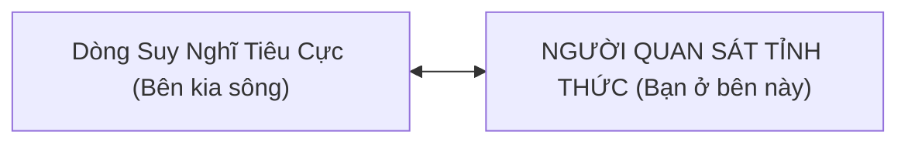

# 📚 SÁCH CHI TIẾT: SỨC MẠNH CỦA SỰ HIỆN DIỆN & TỰ KHAI VẤN NỘI TÂM
*Biên tập chuyên sâu từ bài giảng Viva Women (Buổi 2) - Giảng viên: Đan Mi*

---

## 📖 LỜI TỰA: CHÂN DÙNG "NGƯỜI HÀNH KHẤT" TRONG CUỘC ĐỜI

Rất nhiều người tìm đến các khóa học xây dựng thương hiệu cá nhân, làm video hay kinh doanh số với một mong muốn vội vã: Học ngay các công thức giật tít, kỹ thuật quay dựng hay quy trình kéo traffic nhanh chóng để kiếm tiền. Thế nhưng, tại sao chúng ta lại chưa vội đi vào công thức? Tại sao chúng ta phải dừng lại để học về **Sức mạnh của sự hiện diện**?

Bởi vì nếu bạn mải mê đuổi theo tiền bạc mà quên mất giá trị của sự kết nối, bạn sẽ thấy mình dần cáu kỉnh hơn, phàn nàn nhiều hơn và bất an hơn. Bạn có thể chinh phục được những đỉnh cao tài chính, nhưng khi quay lại, sức khỏe suy kiệt, gia đình rạn nứt và tâm hồn hoàn toàn trống rỗng.

> *"Bất cứ ai dù tài sản của bạn có đồ sộ đến đâu chăng nữa, mà bạn vẫn chưa nhận ra niềm vui của sự ung dung tự tại, chưa có niềm an lạc sâu thẳm ở bên trong tâm hồn, thì bạn vẫn chỉ là một **NGƯỜI HÀNH KHẤT** ở trong cuộc đời này."* — Đan Mi

Xây mình trước khi xây kênh. Sức mạnh của sự hiện diện chính là chiếc mỏ neo giữ bạn ở lại với thực tại, giúp bạn xây dựng một thương hiệu cá nhân chân thật, bền vững và mang năng lượng chữa lành đến cho công chúng.

---

## CHƯƠNG 1: 5 KHÁT KHAO LỚN NHẤT & CẠM BẪY CỦA SỰ VỘI VÃ

### 1. Năm Khát Khao Cốt Lõi Của Con Người
Dù bạn là ai hay đang ở tầng lớp nào trong xã hội, sâu thẳm bên trong bạn luôn tồn tại 5 ước muốn lớn nhất:

1. **Tự do tài chính và sự nghiệp:** Nền tảng vật chất để an tâm sinh sống.
2. **Hạnh phúc gia đình và tình yêu thương:** Khi độc thân khao khát có tình yêu; khi có tình yêu khao khát gia đình ấm êm.
3. **Sức khỏe và sự trường thọ:** Không chỉ muốn sống khỏe mà còn muốn sống lâu để trải nghiệm thế giới.
4. **Mục đích sống và sự cống hiến:** Khao khát biết rõ "Tôi là ai?" và được đóng góp giá trị cho cộng đồng.
5. **Sự bình an trong tâm hồn:** Cái đích cuối cùng và cũng là điều khó chạm tới nhất.

### 2. Cạm Bẫy Của Việc "Đi Tắt"
Đa số mọi người rơi vào vòng lặp mệt mỏi vì họ tìm cách "đi tắt": Lao ra ngoài kiếm tiền (số 1), nhưng sẵn sàng đánh đổi sức khỏe (số 3), bỏ mặc gia đình (số 2) và tàn phá sự bình an nội tâm (số 5). 

Đằng nào làm việc cũng mệt, ngồi không cũng mệt. Nhưng người có sự hiện diện sẽ biết cách làm việc trong sự an lạc. Họ kiến tạo tài chính mà không đánh mất niềm vui sống.

### 3. Bản Lĩnh Của Người Doanh Nhân
> 💬 *"Đã là doanh nhân thì chúng ta không bỏ cuộc. Đằng sau chúng ta không phải chỉ có một mình, mà còn có gia đình, cộng sự và những khán giả đang dõi theo mình."*

Khi bạn nâng tầm nhận thức, bạn không làm việc chỉ vì bản thân nữa. Bạn được **sống trong công việc**. Khi ấy, tâm thế bán hàng của bạn sẽ khác, cách bạn hiện diện trước công chúng sẽ toát ra sự tự tin và trách nhiệm lớn lao.

---

## CHƯƠNG 2: TRÍ NĂNG VÀ BÍ MẬT "ĐỪNG NHẬN GIẶC LÀM CON"

### 1. Trí Năng (Monkey Mind) - Kẻ Thù Nối Tâm Vô Hình
Trí năng là dòng suy tưởng miên man, lo âu, sợ hãi, dằn dỗi không chủ đích liên tục vang lên trong đầu bạn. Trở ngại lớn nhất ngăn cản bạn thành công không phải là đối thủ, là sếp, là chồng hay thời tiết, mà chính là việc **bạn tự đồng hóa mình với trí năng**.

Trí năng có 2 bẫy nguy hiểm:
- Đào bới lại quá khứ để dằn dằn, nuối tiếc.
- Phóng chiếu vào tương lai để lo sợ, bất an.

### 2. Nghệ Thuật Tách Rời "Người Quan Sát"
Làm sao để không bị suy nghĩ tiêu cực lôi kéo? Câu trả lời là: **Đừng chống cự, hãy quan sát.**

> 💬 *"Phía bên kia là những tiếng nói vang lên trong đầu. Còn bên này chính là BẠN. Bạn đang lắng nghe và quan sát nó. Bạn không phải là nó."*



Khi một nỗi sợ hãi xuất hiện (ví dụ: *"Mình ngại quay video quá"*), hãy mỉm cười và nói: *"À, tôi đang quan sát thấy tâm trí mình sinh ra sự ngại ngùng."* Ngay lập tức, nỗi sợ đó bị tước bỏ quyền lực và biến mất.

### 3. Sức Mạnh Của Khoảng Lặng
Đừng đi tìm kiếm sự "truyền động lực" từ bên ngoài. Nếu bạn luôn cần người khác thúc giục hay hô hào mới làm việc, chứng tỏ bên trong bạn vô cùng trống rỗng. 
Một cây cổ thụ muốn lớn mạnh phải chịu được sự cô đơn và khoảnh khắc một mình. Bạn phải có khả năng tự thắp sáng ngọn lửa động lực ngay cả khi ngồi một mình trong phòng tối.

---

## CHƯƠNG 3: ĐẠO CỦA NƯỚC - NGHỆ THUẬT NHU THẮNG CƯƠNG (LÃO TỬ)

### 1. Thuận Theo Dòng Trôi (Thượng Thiện Nhược Thủy)
Nước là thứ mềm yếu nhất trên đời, nhưng không có thứ cứng rắn nào thắng được nước. Nước có thể làm mòn núi đá qua thời gian nhờ sự **bền bỉ và thuận dòng**.

Phụ nữ mệt mỏi là vì luôn gồng mình lên để chèo thuyền ngược dòng, hơn thua đúng sai trong gia đình và công sở. Người bình lặng hơn từ bên trong sẽ nhận được nhiều hơn là mất.

### 2. Ba Bảo Vật Của Lão Tử Trong Ứng Xử
1. **Từ ái (Lòng trắc ẩn):** Yêu thương và bao dung với chính mình và người khác.
2. **Tiết kiệm:** Tiết kiệm năng lượng, lời nói, cảm xúc. Đừng lãng phí năng lượng vào những cuộc cãi vã vô bổ.
3. **Không tranh giành:** Người thiện ta thiện, người không thiện ta vẫn thiện. Vì không tranh giành nên không bao giờ thất bại.

> 💬 *"Một người có sự khiêm hạ, ăn nói từ tốn, nói chậm mà chắc, giữ lấy sự bình an thì sẽ được nhiều hơn là mất so me với việc gồng mình lên đấu tranh, phân bua."*

---

## CHƯƠNG 4: KỶ LUẬT CỦA SỰ CHÚ TÂM & BÍ MẬT HƠI THỞ

### 1. Cương Quyết Chú Tâm Bền Bỉ
Hiện diện không phải là một khẩu hiệu lãng mạn. Đan Mi đưa ra một kỷ luật thép: **"Cương quyết chú tâm bền bỉ vào giây phút hiện tại."**

> 💬 *"Không có gì có thể xảy ra trong quá khứ hay tương lai. Tất cả mọi thứ chỉ có thể xảy ra trong giây phút HIỆN TẠI mà thôi."*

```
Quá khứ = Cái bóng đã qua
Tương lai = Ảo ảnh chưa tới
Hiện tại = Khoảnh khắc VÀNG duy nhất để hành động
```

Sự khác biệt giữa 30% người thành công vượt trội và 70% còn lại không nằm ở công cụ. Công cụ thì đầy trên mạng. Sự khác biệt nằm ở năng lực **kiên trì chú tâm** và đứng lên đi tiếp sau hàng ngàn lần vấp ngã.

### 2. Hơi Thở Kỳ Diệu & "Tâm An Giọng Mới An"
Hơi thở là sợi dây duy nhất nối bạn với sự sống. *"Nếu hơi thở đi mà không về nữa thì cuộc đời chấm dứt."*

Nhiều người nói nhanh, nói vấp, tư duy hỗn loạn là do họ thở nông và mất chánh niệm. Khi bạn ngưng lại vài giây, lắng nghe nhịp thở hít vào - thở ra, tâm trí bạn sẽ tự nhiên lắng xuống. Khi ấy, giọng nói của bạn sẽ tròn vàn, sâu lắng và có sức nặng truyền cảm hứng tự nhiên.

---

## CHƯƠNG 5: QUẢN TRỊ CẢM XÚC & NGHỆ THUẬT BIẾN BẠN ĐỜI THÀNH "BẠN ĐẠO"

### 1. Cơn Giận Qua Đi - Đau Khổ Ở LẠI
Khi bạn nóng giận, gương mặt bạn căng lên, cau có và biến dạng – đó không phải là con người thật của bạn. Sau mỗi cuộc cãi vã hay trút giận, người chịu đau khổ và tổn thương nhất lại chính là bản thân bạn.

**Bí kíp:** Giữ nét mặt và ngưng lại **3 giây** trước khi phản ứng với bất kỳ sự cố nào.

### 2. Từ "Bạn Đời" Tiến Lên "Bạn Đạo"
Trong mối quan hệ gia đình, cảm xúc yêu đương ban đầu rồi cũng sẽ hạ nhiệt. Để ở bên nhau 50-60 năm bình an, hai người phải hướng tới việc trở thành **Bạn Đạo**:
- Ăn cùng một thứ "thức ăn tâm trí" (tri thức, sự tỉnh thức).
- Cùng chia sẻ một giá trị sống và đồng thuận tư duy.
- Hỗ trợ nhau cùng trưởng thành chứ không dằn dỗi hay kiểm soát.

### 3. Tuyên Ngôn Nội Tại Vĩ Đại
> 💬 *"Bạn chính là sự nghiệp vĩ đại nhất trên đời này mà bạn cần phải hoàn thiện."*

Đừng lo lắng làm hài lòng tất cả mọi người. Việc quan trọng nhất của đời bạn là hoàn thiện chính bản thân mình mỗi ngày.

---

## 🎯 BẢNG HƯỚNG DẪN THỰC HÀNH 14 NGÀY (MINDFULNESS FOR NOTION WORKSPACE)

| Tuần | Chủ đề thực hành | Hành động chánh niệm cụ thể | Ứng dụng vào Notion & Công việc (Hằng Võ) |
|:---:|:---|:---|:---|
| **Tuần 1** | **Tách rời Trí năng & Đạo của nước** | - Mức 1: Khi cáu giận/lo lắng, nói thầm: *"Tôi đang quan sát nỗi sợ"*. <br>- Mức 2: Tự ngắt phản ứng 3 giây khi gặp ý kiến trái chiều. | Mở Notion, tạo bảng **Nhật Ký Khảo Cổ Cảm Xúc**. Ghi lại những lần bị trí năng lôi kéo và cách bạn đã tách rời thành công. |
| **Tuần 2** | **Chú tâm bền bỉ & Hiện diện trọn vẹn** | - Mức 1: Tập trung 100% vào hơi thở 5 phút mỗi sáng.<br>- Mức 2: Tắt thông báo, làm đúng 1 việc quan trọng (MIT) trong 45 phút. | Thiết kế lại **Zen Workspace** trên Notion: Tối giản các tab gây xao nhãng, chỉ để lại 3 việc trọng tâm trong ngày. |

---

## 📌 BẢNG TỔNG HỢP CÁC CÂU NÓI CHẠM ĐẮT GIÁ NHẤT (BUỔI 2)

1. *"Bất cứ ai dù tài sản đồ sộ đến đâu mà chưa nhận ra niềm vui ung dung tự tại, thì vẫn chỉ là một người hành khất ở trong cuộc đời này."*
2. *"Trí năng là tiếng ồn trong đầu. Đừng nhận giặc làm con – bạn không phải là suy nghĩ của chính mình."*
3. *"Trên thế gian không có thứ gì mềm yếu như nước nhưng cũng không có thứ gì mạnh mẽ thắng được nước. Nước mềm dẻo nhưng làm mòn cả đá núi."*
4. *"Cương quyết chú tâm bền bỉ vào giây phút hiện tại. Quá khứ đã qua, tương lai chưa tới, chỉ có hiện tại là có thật."*
5. *"Bạn chính là sự nghiệp vĩ đại nhất trên đời này mà bạn cần phải hoàn thiện."*
