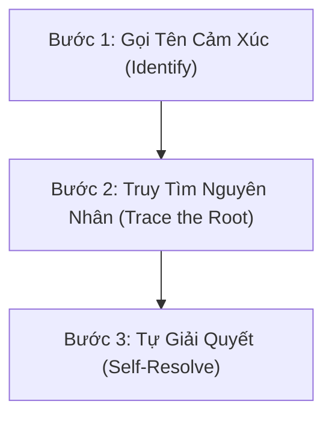

# 📚 SÁCH CHI TIẾT: TỰ KHAI VẤN - HÀNH TRÌNH TÌM RA VÀ GIỮ GÌN CHÍNH MÌNH
*Biên tập tinh hoa từ bài giảng Viva Women (Buổi 3) - Giảng viên: Đan Mi & Khách mời Thanh Hiền*

---

## 📖 LỜI NÓI ĐẦU: TRIẾT LÝ VỀ SỰ RUNG CẢM BAN ĐẦU

Trong hành trình xây dựng thương hiệu cá nhân và phát triển sự nghiệp số, đa số mọi người đều quá mải mê chạy theo các chiêu trò truyền thông, thuật toán mạng xã hội hay các chiến thuật kéo traffic nhanh chóng. Tuy nhiên, nếu thiếu đi một nền tảng nội lực vững chắc, những chiến thuật đó chỉ giống như việc bạn cố gắng xây một tòa nhà chọc trời trên nền cát mịn.

Mạng xã hội thực chất chỉ là một chiếc **kính phóng đại khổng lồ**. Khi bạn sở hữu bên trong mình sự chân thành, tri thức sâu sắc và tấm lòng bao dung, mạng xã hội sẽ phóng đại những giá trị tốt đẹp đó lên gấp hàng ngàn lần, giúp bạn chạm đến trái tim của đông đảo công chúng. Ngược lại, nếu bên trong bạn là sự rỗng tuếch, ngạo mạn hay đầy mâu thuẫn, công nghệ không thể giúp bạn "đổi đời" bền vững. 

Thành công thực sự trong giao tiếp, bán hàng và xây dựng cộng đồng không xuất phát từ chiêu trò, mà đến từ **Rung cảm ban đầu** – sự khiêm hạ, lòng trắc ẩn và văn hóa ứng xử từ sâu thẳm con người bạn.

> *"Hãy trở thành một người mà nếu như người ta đã gặp bạn rồi, người ta sẽ luôn muốn gặp lại bạn thêm một lần nữa. Khi bạn nắm được chìa khóa này, bạn làm kênh sẽ thành công, bán hàng sẽ thành công và mọi mối quan hệ đều sẽ nảy nở."* — Đan Mi

---

## PHẦN 1: NĂNG LỰC NỘI TẠI VÀ BẢN LĨNH CỦA NGƯỜI PHỤ NỮ

### 1. Năng Lực Của Một "Người Mẹ" Và Sự Kiên Nhẫn Trong Hành Trình
Khi làm công việc đào tạo hay làm việc với con người, điều quan trọng nhất không phải là lượng kiến thức bạn đổ xuống, mà là tấm lòng và sự bao dung bạn trao đi. Bởi vì **"Có hiểu thì mới có thương"**, và biểu hiện cao nhất của tình thương chính là **Sự Kiên Nhẫn**.

Nhiều người làm kinh doanh hay xây kênh thường rơi vào trạng thái nản lòng, lười giao tiếp hoặc sợ hãi. Nguyên nhân gốc rễ không phải vì họ thiếu năng lực, mà vì họ không đủ sự kiên nhẫn với chính mình và khách hàng. Họ chỉ yêu thích khoảnh khắc cuối cùng khi được nhận tiền hoặc khi bài viết viral, nhưng lại chán ghét hành trình miệt mài từ bước đầu tiên tiếp cận khách hàng.

Phụ nữ sở hữu một năng lực thiên bẩm tuyệt vời giống như một người mẹ. Dù bạn đã làm mẹ hay chưa, khi bạn thổi tình yêu thương và sự bao dung của một người mẹ vào công việc, bạn sẽ rèn luyện được sự chú tâm kiên nhẫn trong từng chi tiết nhỏ. Khi ấy:
- Bạn không còn cảm thấy bực mình, khó chịu hay tức giận trước những sự cố.
- Tâm trí bạn tự động trở về trạng thái **Tĩnh lặng**.
- Bạn biết đặt tình yêu vào cả quá trình trải nghiệm chứ không chỉ dồn mọi kỳ vọng vào kết quả cuối cùng.

### 2. "Tâm An Thì Giọng Mới An"
Sự bình an không thể được giả tạo bằng các kỹ thuật bên ngoài. Nếu bên ngoài bạn cố tỏ ra điềm tĩnh nhưng bên trong nội tâm đang dậy sóng hoài nghi hay tức giận, hai trạng thái trái ngược đó sẽ lập tức xung đột. Sự mất cân bằng này sẽ bộc lộ ngay qua ánh mắt và đặc biệt là qua **giọng nói** của bạn.

Giọng nói là chiếc gương phản chiếu năng lượng nội tâm. Chỉ khi Thân - Tâm - Trí của bạn hợp nhất, khi lòng bạn thực sự an trú trong hiện tại, giọng nói của bạn mới toát ra sự ấm áp, truyền cảm và mang năng lượng chữa lành đến cho người nghe.

### 3. Bài Học "Cốc Nước Và Nắm Muối"
Những biến cố, lời chỉ trích hay áp lực trong cuộc sống giống như một nắm muối. 
- Nếu bạn ví tâm mình nhỏ bé như một **cốc nước**, khi ném nắm muối vào, nước trong cốc sẽ trở nên mặn chát, không thể uống nổi. Bạn sẽ dễ dàng bị hoàn cảnh xung quanh làm cho đắng cay, cáu gắt và hòa tan vào sự tiêu cực.
- Nhưng nếu bạn rèn luyện để tâm mình rộng lớn như **một dòng sông hay biển cả**, nắm muối đó ném xuống sẽ trở nên hoàn toàn vô hại. Dòng nước vẫn giữ được sự ngọt ngào và mát lành.

> *"Những vấn đề trong cuộc sống sẽ tự động biến mất khi năng lượng và tấm lòng của bạn trở nên lớn hơn vấn đề."*

### 4. Ba Lần Trưởng Thành Của Một Con Người
Con người chúng ta thường đi qua 3 mốc trưởng thành quan trọng trong nhận thức:
1. **Lần trưởng thành thứ nhất:** Khi nhận ra mình không phải là trung tâm của vũ trụ.
2. **Lần trưởng thành thứ hai:** Khi nhận ra có những điều dù đã cố gắng hết sức nhưng vẫn nằm ngoài tầm kiểm soát của bản thân.
3. **Lần trưởng thành thứ ba:** Khi nhận ra cuộc đời này ai cũng có cả mặt tốt lẫn mặt xấu, nhưng bạn vẫn chủ động lựa chọn đối xử với thế giới bằng **sự tử tế, chân thành và bao dung**.

Nếu người khác cư xử không tốt với mình mà mình cũng đáp trả bằng sự hẹp hòi tương tự, thì mình không khác gì họ. Đẳng cấp của một người phụ nữ trí tuệ là biết đứng ở một tầng năng lượng cao hơn: Không tranh chấp, không hơn thua, không so bì.

---

## PHẦN 2: TƯƠNG TÁC TẠO TÀI SẢN (CHIA SẺ TỪ KHÁCH MỜI THANH HIỀN)

### 1. Triết Lý "Sự Hiện Diện" Trên Không Gian Số
Trong kỷ nguyên số, nhiều người lầm tưởng rằng việc đi bình luận (comment) trên mạng xã hội chỉ là một hành động xã giao "cho có", hoặc là nhiệm vụ bắt buộc để giữ tương tác. Tuy nhiên, dưới góc nhìn chuyên sâu, tương tác chính là **Sự Chủ Động Hiện Diện**.

Khi bạn lướt qua một bài viết, nếu chỉ âm thầm đọc rồi lướt đi vì bí từ hay ngại ngùng, bạn đang bỏ lỡ cơ hội gieo hạt kết nối. Sự hiện diện chủ động nghĩa là bạn xuất hiện trong không gian của người khác với một thái độ tôn trọng và quan tâm chân thành. Đôi khi, chỉ một lời khen tinh tế, một câu hỏi gợi mở hay một lời khích lệ đúng lúc cũng có thể bắt đầu cho một cuộc trò chuyện sâu, biến một người xa lạ trở thành tri kỷ hoặc khách hàng tiềm năng.

### 2. Kỹ Xảo Tương Tác Tạo Rung Cảm (Actionable Practice)
Để tương tác không bị khô cứng và dạt dào ngôn từ, bạn có thể áp dụng ngay các kỹ xảo thực chiến:
- **Kỹ xảo Tag tên gieo giá trị:** Thay vì comment vô thưởng vô phạt, hãy tag tên một người bạn thân thiết vào bài viết kèm lời nhắn: *"Này, đúng chủ đề hôm trước chúng mình đang bàn dở này, đọc ngay nhé!"* hoặc *"Tớ nghĩ cậu sẽ rất thích góc nhìn này đấy, đọc xong cho tớ xin ý kiến nhé!"*
- **Kỹ xảo chia sẻ cảm xúc chân thật:** Đọc kỹ một điểm chạm trong bài viết và chia sẻ lại trải nghiệm tương đồng của bản thân.
- **Thực hành hiện diện cộng đồng:** Chụp một bức ảnh không gian học tập/làm việc chỉnchu, viết một cảm nhận ngắn và hiện diện trên các cộng đồng chuyên môn với tinh thần trao giá trị.

---

## PHẦN 3: NGỤ NGÔN HẠNH PHÚC VÀ 3 BƯỚC TỰ KHAI VẤN

### 1. Chuyện Ngụ Ngôn "Bọn Yêu Tinh Giấu Hạnh Phúc"
Ngày xưa, một tập đoàn yêu tinh họp bàn để tìm cách làm hại con người bằng cách giấu đi thứ quý giá nhất của họ: **Hạnh phúc**.
- Một con yêu tinh đề xuất: *"Hãy giấu nó trên đỉnh núi cao nhất!"* -> Con yêu tinh khác phản đối: *"Không được, con người rất khỏe mạnh, họ sẽ leo lên đến nơi."*
- Con khác gợi ý: *"Hãy đem giấu dưới đáy biển sâu nhất!"* -> Phản đối: *"Con người rất tò mò, họ sẽ chế ra tàu ngầm lặn xuống lấy."*
- Con khác nói: *"Đưa nó sang một hành tinh khác!"* -> Phản đối: *"Con người rất thông minh, họ sẽ chế phi thuyền khám phá vũ trụ."*

Cuối cùng, một con yêu tinh già lụ khụ đứng dậy nói:  
> *"Ta biết nên giấu hạnh phúc ở đâu rồi. Hãy giấu nó ở CHÍNH BÊN TRONG CON NGƯỜI. Đa số mọi người đều mải mê lùng sục hạnh phúc ở khắp mọi nơi, so sánh với người khác mà chẳng bao giờ chịu quay vào bên trong. Giấu ở đó, họ sẽ không bao giờ tìm thấy."*

Tất cả yêu tinh đều đồng ý. Và từ đó, con người cứ mải miết chạy ra ngoài tìm kiếm hạnh phúc mà quên mất nó vốn đã được cất giấu ngay trong tâm hồn mình.

### 2. Ba Giai Đoạn Về "Chính Mình"
Muốn sống một cuộc đời ý nghĩa, bạn phải đi qua đủ 3 giai đoạn:
1. **Tìm ra chính mình (Self-Discovery):** Biết rõ mình là ai, giá trị cốt lõi là gì, điểm mạnh và giới hạn ở đâu.
2. **Làm ra chính mình (Self-Creation):** Trau dồi kỹ năng, kiến tạo tư duy và xây dựng bản thân thành phiên bản giá trị.
3. **Giữ được chính mình (Self-Preservation):** Không bị danh lợi, sự gièm pha hay biến cố cuộc đời làm biến chất hay đánh mất sự tử tế ban đầu.

### 3. Quy Trình 3 Bước Tự Khai Vấn (Self-Coaching Protocol)
Cái tôi hiện tại của bạn là kết quả của 20-30 năm định hình từ môi trường, giáo dục và cả những tổn thương quá khứ. Để không bị cái tôi tiêu cực điều khiển, bạn cần rèn luyện năng lực **Tự Khai Vấn** qua 3 bước:



- **Bước 1: Gọi tên cảm xúc (Identify):** Dừng lại và quan sát chính xác cảm xúc đang diễn ra bên trong. *(Tôi đang tức giận, đố kỵ, tổn thương hay tự ti?)*
- **Bước 2: Truy tìm nguyên nhân gốc rễ (Trace the root):** Đặt câu hỏi *"Tại sao tôi lại có phản ứng này? Kỳ vọng hay tổn thương nào trong quá khứ của tôi đang bị chạm tới?"*
- **Bước 3: Tự giải quyết (Self-resolve):** Dũng cảm nhìn thẳng vào sự thật, tự điều chỉnh góc nhìn mà không chạy ra ngoài tìm kiếm sự xoa dịu giả tạo hay tìm người đồng tình để thỏa mãn cái tôi cố chấp.

> Năng lực tự đặt câu hỏi tỷ lệ thuận với năng lực ra quyết định. Khi bạn hiểu rõ chính mình, bạn không cần phải phụ thuộc vào sự xác nhận (validation) từ đám đông.

---

## PHẦN 4: TƯ DUY NĂNG LƯỢNG VÀ CHÂN DÙNG "NGƯỜI GIÀU MỚI"

### 1. Sự Khác Biệt Giữa Thành Công Và Hạnh Húc (Bài Học Nhà Sư & Tù Nhân)
Chúng ta thường đánh đồng thành công với hạnh phúc, nhưng đây là hai khái niệm hoàn toàn tách biệt:
- **Thành công:** Là việc đạt được các mục tiêu đo lường được bên ngoài (hoàn thành dự án, mốc thu nhập, danh vọng).
- **Hạnh phúc:** Là trạng thái bình an và thỏa mãn nội tâm từ bên trong, không phụ thuộc vào hoàn cảnh bên ngoài.

Hãy so sánh một **nhà sư già** sống kham khổ trong tu viện và một **tù nhân** sống trong phòng giam có đầy đủ tiện nghi vật chất. Nhà sư luôn mỉm cười bình an, còn tù nhân thì phẫn uất, đau khổ. Điểm khác biệt duy nhất ở đây chính là chữ **"MUỐN"**: Nhà sư tự nguyện chọn cuộc sống đó, còn tù nhân bị ép buộc.

> *"Hạnh phúc xuất hiện khi tâm bạn hoàn toàn an trú và tự nguyện với những gì đang diễn ra ở hiện tại."*

### 2. Chân Dung 5 Khía Cạnh Của "Người Giàu Mới" (The New Rich)
Thời đại số định nghĩa lại sự giàu có không chỉ dừng lại ở số dư tài khoản, mà bao gồm 5 trụ cột toàn diện:

```
                  ┌────────────────────────┐
                  │   NGƯỜI GIÀU MỚI      │
                  └───────────┬────────────┘
        ┌─────────────┬───────┴───────┬─────────────┐
        ▼             ▼               ▼             ▼
   1. SỨC KHỎE   2. TIỀN BẠC    3. HÀO PHÓNG   4. TÂM TRÍ / MỐI QUAN HỆ
(Khỏe, đẹp,   (Tự do tài    (Trao giá trị   (Ý nghĩa sống &
 tự nhiên)     chính)        vật chất)       kết nối chân thành)
```

1. **Giàu Sức Khỏe:** Khỏe mạnh, tràn đầy năng lượng, đẹp tự nhiên và tự tin.
2. **Giàu Tiền Bạc:** Làm chủ tài chính để có quyền lựa chọn sự tự do.
3. **Giàu Sự Hào Phong:** Có tiềm lực vật chất để giúp đỡ người khác *(Bạn không thể trả hóa đơn hay nuôi con chỉ bằng một cái ôm)*.
4. **Giàu Tâm Trí:** Sống có lý tưởng, có ý nghĩa và tạo ra giá trị thực cho xã hội.
5. **Giàu Mối Quan Hệ:** Xây dựng mạng lưới kết nối chất lượng dựa trên sự chân thành và văn hóa ứng xử cao đẹp.

### 3. Quy Luật Giá Trị Trên Thị Trường
> 💬 *"Chúng ta không được thị trường trả tiền cho thời gian chúng ta bỏ ra. Chúng ta được trả tiền cho GIÁ TRỊ mà chúng ta mang lại cho thị trường."*

Nếu muốn tăng thu nhập từ 10 triệu lên 100 triệu, bạn không thể đòi hỏi làm việc gấp 10 lần thời gian (vì ai cũng chỉ có 24h). Con đường duy nhất là **nâng cấp giá trị bản thân gấp 10 lần** thông qua việc mở khóa các kỹ năng mới: Quản trị hệ thống, ứng dụng AI, tư duy chiến lược và năng lực giao tiếp.

---

## PHẦN 5: NGÔI NHÀ NỘI LỰC VÀ HÀNH ĐỘNG THỰC CHUYỂN

### 1. Cấu Trúc Ngôi Nhà Nội Lực
Nhiều người vội vã xây dựng "phong cách sống" sang chảnh trên mạng xã hội nhưng lại dễ dàng sụp đổ trước biến cố. Đó là vì họ chỉ lo làm phần Mái nhà mà bỏ quên Nền móng.

```
                  ┌──────────────────────────────┐
                  │  MÁI NHÀ: Phong cách sống    │
                  │  (Thương hiệu cá nhân)      │
                  └──────────────┬───────────────┘
                                 │
           ┌─────────────────────┴─────────────────────┐
           │                                           │
           ▼                                           ▼
┌──────────────────────┐                   ┌──────────────────────┐
│  BỨC TƯỜNG TRÁI:     │                   │  BỨC TƯỜNG PHẢI:     │
│  Sự nghiệp & Tài chính│                   │  Mối quan hệ chất lượng│
└──────────┬───────────┘                   └──────────┬───────────┘
           │                                           │
           └─────────────────────┬─────────────────────┘
                                 │
                  ┌──────────────▼───────────────┐
                  │   NỀN MÓNG VỮNG CHẮC:        │
                  │   Thân - Tâm - Trí khỏe mạnh │
                  └──────────────────────────────┘
```

- **Nền móng:** Thân - Tâm - Trí khỏe mạnh, nội lực bình an.
- **Hai bức tường:** Sự nghiệp tài chính vững vàng và Mối quan hệ chân thành.
- **Mái nhà:** Phong cách sống và Thương hiệu cá nhân.

Khi Nền móng và Bức tường chưa có, đừng cố vẽ ra một phong cách sống sáo rỗng. Hãy đi từ gốc rễ.

### 2. Kế Hoạch 5 Hành Động Nhỏ Mỗi Ngày (Micro-Habits)
Đừng vội đặt ra những sứ mệnh quá vĩ đại khi những việc nhỏ nhất chưa làm tròn. Hãy bắt đầu ngay hôm nay:
1. **Đọc sách 30 phút/ngày:** Nạp tri thức chất lượng vào tâm trí.
2. **Vận động thể chất 30 phút/ngày:** Đi dạo, tập yoga để giải phóng cortisol và tăng cường sức khỏe.
3. **Viết 3 điều biết ơn mỗi ngày:** Neo giữ sự chú tâm vào những điều tích cực đang có.
4. **Rèn luyện 1 kỹ năng chuyên sâu 30 phút/ngày:** Học Notion, AI, luyện giọng nói hoặc chuyên môn kế toán/xây hệ thống.
5. **Lập kế hoạch công việc ngày hôm sau:** Chọn ra 3 việc quan trọng nhất (MITs) để tập trung giải quyết.

---

## 🎯 TÓM TẮT KHÓA HỌC & BẢNG ĐÚC KẾT HÀNH ĐỘNG

| STT | Trích dẫn & Bài học chạm từ Giảng viên | Kế hoạch hành động áp dụng ngay (Cho Hằng Võ) |
|:---:|:---|:---|
| **1** | *"Có hiểu thì mới có thương... Tình thương chính là sự kiên nhẫn."* | Khi hỗ trợ khách hàng/học viên, chậm lại 3 giây, đặt sự bao dung của người mẹ vào từng bước hướng dẫn. |
| **2** | *"Vấn đề sẽ không còn khi bạn lớn hơn vấn đề."* | Đứng trước sự cố công việc, tự hỏi: *"Làm sao để tâm mình lớn như dòng sông chứ không phải cái cốc?"* |
| **3** | *"Kênh chỉ phóng đại những gì bạn có sẵn bên trong."* | Tập trung 80% lực vào việc vun bồi "Tài sản nội tâm" và dọn dẹp hệ thống số thật chuẩn trước khi đẩy mạnh truyền thông. |
| **4** | *"Hãy trở thành người mà ai gặp rồi cũng muốn gặp lại lần nữa."* | Giữ thái độ khiêm hạ, lịch thiệp và văn hóa ứng xử cao đẹp trong mọi điểm chạm giao tiếp. |
| **5** | *"Chúng ta không được trả tiền cho thời gian, mà trả cho GIÁ TRỊ."* | Liên tục học thêm kỹ năng mới (AI, Công cụ tự động hóa) để tăng giá trị mỗi giờ làm việc. |
| **6** | *"Tương tác là sự CHỦ ĐỘNG HIỆN DIỆN."* | Dành 15 phút mỗi ngày đi bình luận có chiều sâu, tag tên bạn bè hoặc đặt câu hỏi mở trên các bài viết giá trị. |
